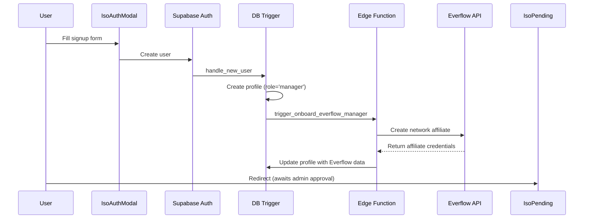
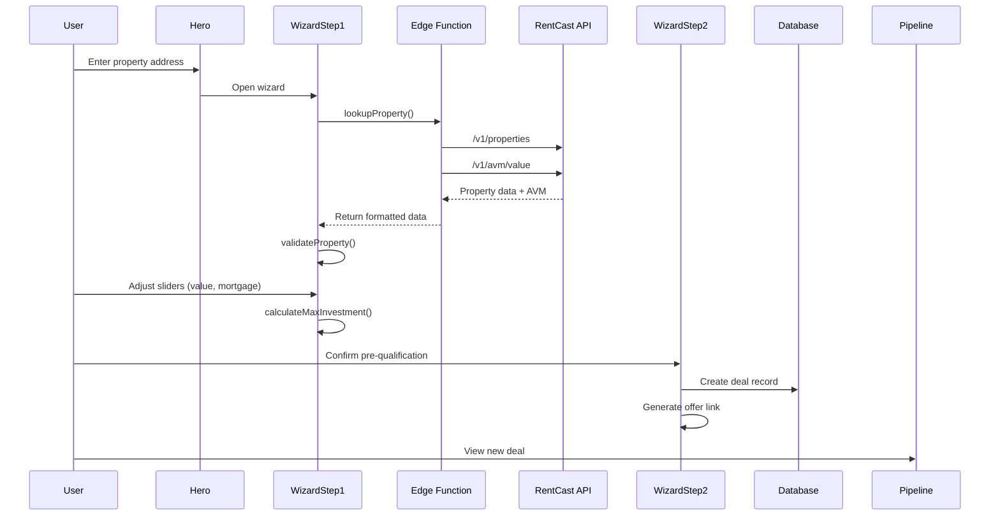
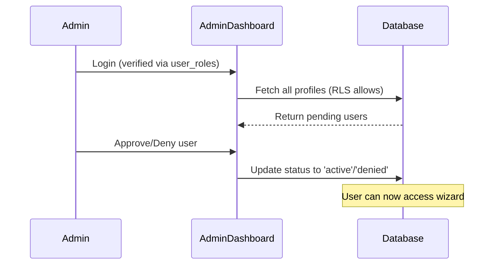

# Equity Advance Broker Portal - Project Map

> **External Brain & Long-Term Memory Anchor**

---

## 1. Project Vision

**North Star:** Equity Advance Broker Portal is an automated underwriting and deal management platform that enables mortgage brokers (ISOs) to pre-qualify homeowners for Home Equity Agreements (HEAs) and track deals through the sales pipeline.

---

## 2. Tech Stack

### Frontend
| Technology | Purpose |
|------------|---------|
| React 18.3 | UI framework |
| TypeScript | Type safety |
| Vite | Build tool |
| Tailwind CSS | Styling |
| tailwindcss-animate | Animations |
| shadcn/ui | Component library (Radix primitives) |
| TanStack React Query | Data fetching & caching |
| React Router DOM v6 | Client-side routing |
| React Hook Form + Zod | Form handling & validation |
| Recharts | Data visualization |

### Backend (Lovable Cloud)
| Technology | Purpose |
|------------|---------|
| Supabase Auth | Email/password authentication |
| Supabase Database | PostgreSQL data storage |
| Supabase Edge Functions | Deno runtime serverless functions |

### Third-Party Integrations
| Service | Purpose |
|---------|---------|
| Everflow API | Affiliate tracking, broker onboarding |
| RentCast API | Property data, AVM valuations |
| Google Maps API | Address autocomplete |

---

## 3. File Topology (Single Source of Truth)

```
src/
├── hooks/
│   ├── useAuth.ts              # Auth state: user, session, isAdmin, userRole, userStatus
│   └── usePipelineDeals.ts     # Pipeline data fetching and stage grouping
├── lib/
│   ├── heaCalculator.ts        # HEA underwriting logic (19.9% cap, eligibility)
│   └── api/rentcast.ts         # RentCast API client wrapper
├── components/
│   ├── IsoAuthModal.tsx        # Login/Signup modal with Everflow trigger
│   ├── WizardStep1.tsx         # Property validation (fetches RentCast data)
│   ├── WizardStep2.tsx         # Pre-qualification result, deal creation
│   ├── WizardStep3.tsx         # Settlement estimator display
│   ├── AdminRoute.tsx          # Route guard for admin users
│   ├── ManagerRoute.tsx        # Route guard for manager users
│   └── pipeline/
│       ├── PipelineColumn.tsx  # Pipeline stage column component
│       └── DealCard.tsx        # Individual deal card display
├── pages/
│   ├── Index.tsx               # Homepage with address input
│   ├── Pipeline.tsx            # Deal pipeline Kanban view
│   ├── AdminDashboard.tsx      # User approval management
│   ├── TeamManagement.tsx      # Manager's officer management
│   ├── IsoPending.tsx          # Pending approval waiting page
│   └── OfficerSignup.tsx       # Officer invitation signup
├── contexts/
│   └── WizardContext.tsx       # Underwriting wizard state management
├── integrations/supabase/
│   ├── client.ts               # Supabase client (auto-generated, DO NOT EDIT)
│   └── types.ts                # Database types (auto-generated, DO NOT EDIT)
supabase/
├── functions/
│   ├── onboard-everflow-manager/   # Everflow affiliate creation
│   └── rentcast-property-lookup/   # Property data API proxy
└── migrations/                     # Database schema migrations (DO NOT EDIT)
```

---

## 4. Data Schema

### profiles Table
| Column | Type | Description |
|--------|------|-------------|
| id | uuid | Primary key, references auth.users |
| email | text | User email |
| full_name | text | Display name |
| role | user_role enum | 'manager' or 'officer' |
| status | user_status enum | 'pending', 'active', 'denied' |
| everflow_id | text | Everflow affiliate ID |
| parent_id | uuid | Officer's parent manager ID |
| invite_token | uuid | Manager's officer invite token |
| cell_phone | text | User phone number |
| company_name | text | Company/brokerage name |
| company_url | text | Company website URL |
| billing_completed | boolean | Billing setup status |
| paperwork_completed | boolean | Paperwork status |
| created_at | timestamptz | Record creation timestamp |
| updated_at | timestamptz | Record update timestamp |
| everflow_user_id | text | Everflow user ID |
| everflow_account_status | text | Everflow account status |
| everflow_network_id | text | Everflow network ID |
| everflow_tracking_domain | text | Everflow tracking domain |
| everflow_api_key | text | Everflow API key |
| everflow_encoded_value | text | Everflow encoded value for links |

### deals Table
| Column | Type | Description |
|--------|------|-------------|
| id | uuid | Primary key |
| user_id | uuid | Deal originator (references profiles.id) |
| property_address | text | Full property address |
| home_value | numeric | Estimated home value |
| mortgage_balance | numeric | Current mortgage balance |
| max_investment | numeric | Max HEA funding amount |
| owner_names | text[] | Property owner names array |
| everflow_event_status | text | Pipeline stage |
| created_at | timestamptz | Record creation timestamp |
| offer_link | text | Everflow tracking URL |

### user_roles Table
| Column | Type | Description |
|--------|------|-------------|
| id | uuid | Primary key |
| user_id | uuid | References auth.users |
| role | app_role enum | 'admin' |
| created_at | timestamptz | Record creation timestamp |

### Enums
| Enum | Values |
|------|--------|
| app_role | admin |
| user_role | manager, officer |
| user_status | pending, active, denied |

### RLS Policies Summary
| Table | Policy |
|-------|--------|
| profiles | Users can view/update own; Admins can view/update/delete all; Insert via auth trigger only |
| deals | Users can CRUD own; Managers can view officer deals; Admins can view/update all |
| user_roles | Users can view own roles; Admins can view all |

---

## 5. Core Workflows

### Workflow A: Broker Signup and Everflow Onboarding



### Workflow B: Property Underwriting Sequence



### Workflow C: Admin User Approval



---

## 6. Key Constants (heaCalculator.ts)

| Constant | Value | Description |
|----------|-------|-------------|
| ANNUALIZED_COST_LIMIT | 19.9% | Safety cap on HEA returns |
| EXCHANGE_RATE | 2.0 | Funding to equity share multiplier |
| MAX_UNLOCK_PERCENTAGE | 49.9% | Maximum equity share |
| MIN_HOME_VALUE | $175,000 | Minimum property value |
| MAX_HOME_VALUE | $3,000,000 | Maximum property value |
| ABSOLUTE_MAX_INVESTMENT | $500,000 | Maximum funding amount |

---

## 7. Environment Variables

### Required Secrets (Lovable Cloud)
| Variable | Purpose |
|----------|---------|
| SUPABASE_URL | Database project URL |
| SUPABASE_ANON_KEY | Anonymous key for client |
| SUPABASE_SERVICE_ROLE_KEY | Service role key for edge functions |
| Everflow | Everflow API key |
| RENTCAST_API_KEY | RentCast API key |
| VITE_GOOGLE_MAPS_API_KEY | Google Maps address autocomplete |

---

## 8. Pipeline Stages

| Order | Stage Name | Description |
|-------|------------|-------------|
| 1 | Offer Generated | Initial offer created by broker |
| 2 | Offer Link Clicked | Homeowner clicked tracking link |
| 3 | Application Created | Homeowner started application |
| 4 | Application Qualified | Basic eligibility confirmed |
| 5 | Estimate Prepared | HEA terms calculated |
| 6 | Application Completed | All info submitted |
| 7 | Underwriting Submitted | Sent for review |
| 8 | Review Requested | Additional review needed |
| 9 | Final Offer Presented | Terms finalized |
| 10 | Funds Disbursed | Money transferred |
| 11 | Closed Lost | Deal did not proceed |

---

## 9. Admin Users

| Email | Role | Privileges |
|-------|------|------------|
| max@equityadvance.com | admin | God Mode - view all deals across all brokers |

---

*Last Updated: December 2024*
